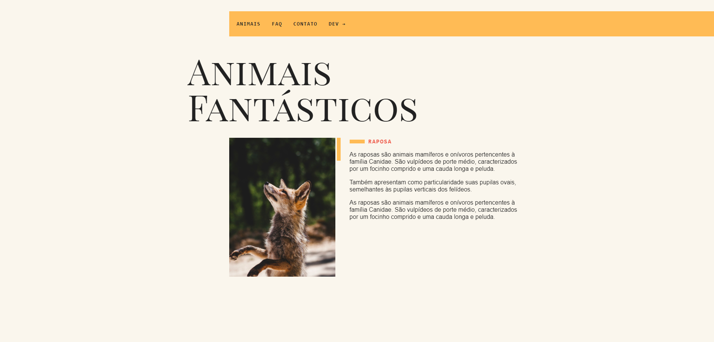

# Animais Fantásticos, Origamid 🐺

## Preview:

## Descrição:

Projeto realizado com JS Vanilla com a finalidade de fixação de conteúdo. O site contém algumas animações, como por exemplo: Ao scrollar o site, os itens vão aparecendo gradativamente, efeito adicionado com JS Vanilla, sem lib externa. Caso queira visualizar o proejto finalizado, acesse [Aqui](https://https://1maatheus.github.io/Animais-Fantasticos/).
